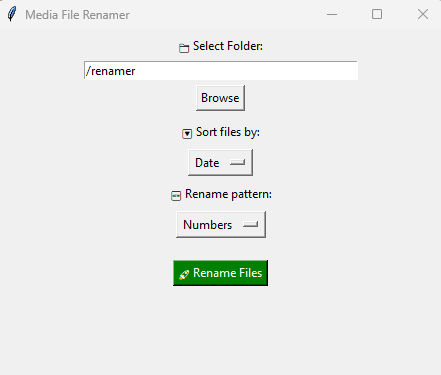
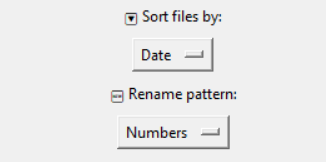
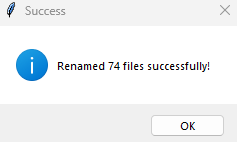

# 🪄 Media File Renamer

**Media File Renamer** is a fast, clean GUI tool to **bulk rename images and videos** by size, name, or photo metadata (EXIF). Rename like a pro — whether you're organizing a camera roll or prepping a media library.
---

## ✨ Features

- 🔁 **Bulk Rename** by:
  - 📂 File name (A–Z / Z–A)
  - 🗓️ Date Taken (EXIF metadata)
  - 📦 File Size (ascending/descending)
- 🪪 Rename formats: `IMG_001`, `1`, etc.
- 🧠 Smart handling of images/videos
- 🔍 Preview thumbnails and sort visually
- 💥 Built-in EXIF parser (Pillow)
- 🔒 Safe skip of corrupt or unreadable files

---

## 📦 Supported Formats

🎞️ **Video**: `.mp4`, `.mov`, `.avi`  
🖼️ **Images**: `.jpg`, `.jpeg`, `.png`, `.gif`

> EXIF sort works with most modern cameras and smartphones.

---

## 🚀 Getting Started

### 🖥️ For Windows (No Python Required)

1. **Download** the latest `.zip` from [Releases](https://github.com/Garuda8887/Renamer/releases)
2. **Extract** and **double-click** the `.exe` file
3. Select a folder → Choose sort method → Pick rename pattern → 💫 **Done!**

> ℹ️ Windows SmartScreen may warn on first run (due to unsigned EXE). You can safely allow it or build from source below.

---

### 🐍 Run via Python (Cross-platform)

1. Clone the repo:
   ```bash
   git clone https://github.com/Garuda8887/Renamer.git
   cd Renamer
   ```

2. Install dependencies:
   ```bash
   pip install Pillow
   ```

3. Run the app:
   ```bash
   python renamer.py
   ```

---

## 🧪 Screenshots

| 📂 Browse Folder | 🔤 Rename Options | ✅ Success |
|------------------|------------------|------------|
|  |  |  |

---

## 📄 License & Attribution

Licensed under the **MIT License** — free to use, modify, and distribute.  
If you use this project, please give credit to:

**© 2025 [Garuda8887](https://github.com/Garuda8887)**

---

## 🛡️ Disclaimer

This is an open-source tool. The `.exe` is **self-signed** and may trigger antivirus warnings.  
You can always inspect or run the source code directly.
